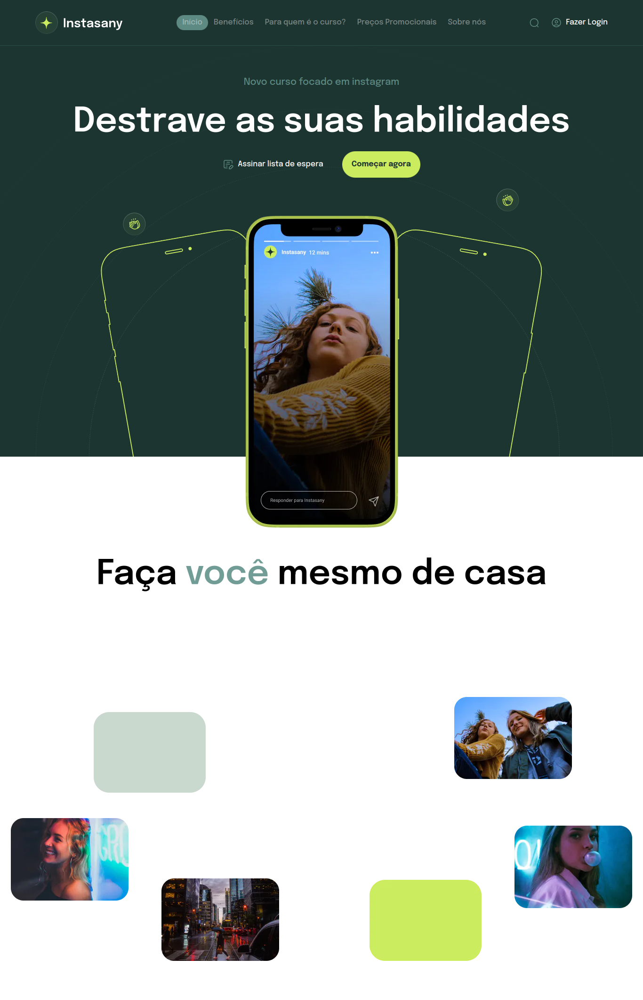

# Instasany


Uma aplicação para cursos de instagram criado pelo Gerson

## Índice
- <a href="#layout">Layout</a>
- <a href="#demonstracao">Demonstração</a>
- <a href="#run">Run Projecto</a>
- <a href="#tecnologias">Tecnologias Utilizadas</a>
- <a href="#autores">Pessoa Autora</a>
- <a href="#passos">Prṕximos Passos</a>


## Layout


## Demostração
[Instasany](https://instasany.vercel.app)

## Run Projecto

```bash
# Clone este repositório
$ git clone linkrepo

# Acesse a pasta do projecto no seu terminal
$ cd instasany

# Instale as dependências 
$ npm install

# Execute a aplicação
$ npm run dev

# A aplicação será iniciada na porta 3000, acesse pelo navegador: http://localhost:3000
```

# 🛠Tecnologias Utilizadas
1. [NextJS](https://nextjs.org/)
2. [TailwindCSS](https://tailwindcss.com/)
3. [React](https://react.dev/)
4. [ReactDom](https://legacy.reactjs.org/docs/react-dom.html)
5. [GSAP](https://gsap.com/)

## 🤓Pessoa Autora


################################

[Linkedin](https://www.linkedin.com/in/gerson-ndombaxi-7b4867212/)

[Instagram](https://www.instagram.com/gerson.paulo16/)